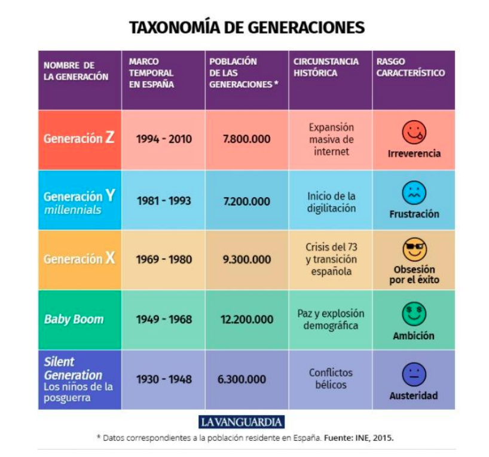

##  ** Programacion I **   

**_Descripción por proyecto:_**

Se desea un programa que devuelva la generación a la que pertenece un estudiante. Se necesita 
ingresar nombre, edad, DNI, sexo (H hombre, M mujer), año de nacimiento, carrera/curso y lugar de 
estudio. 
El programa podrá devolver solo la generación o todos los datos del estudiante

**Alumnos:**

 - Eric Eduardo Rodriguez
 - Aylen Duarte
